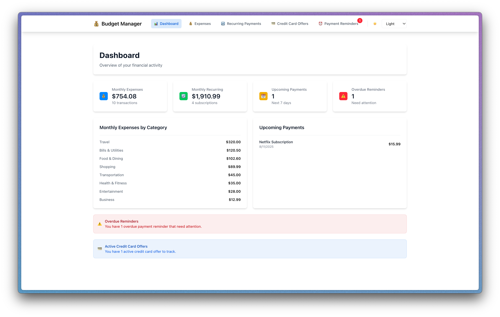
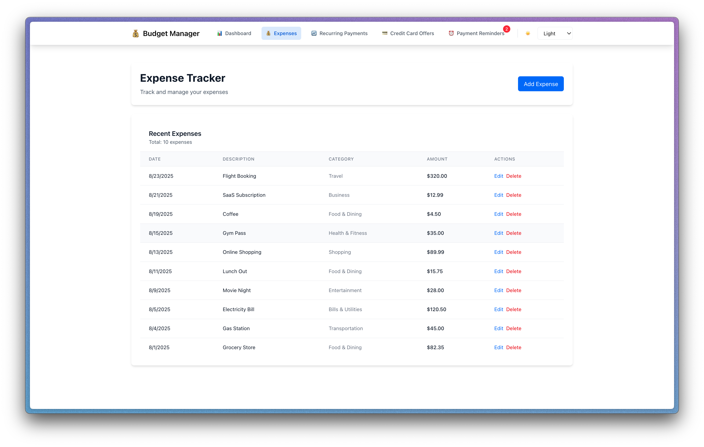
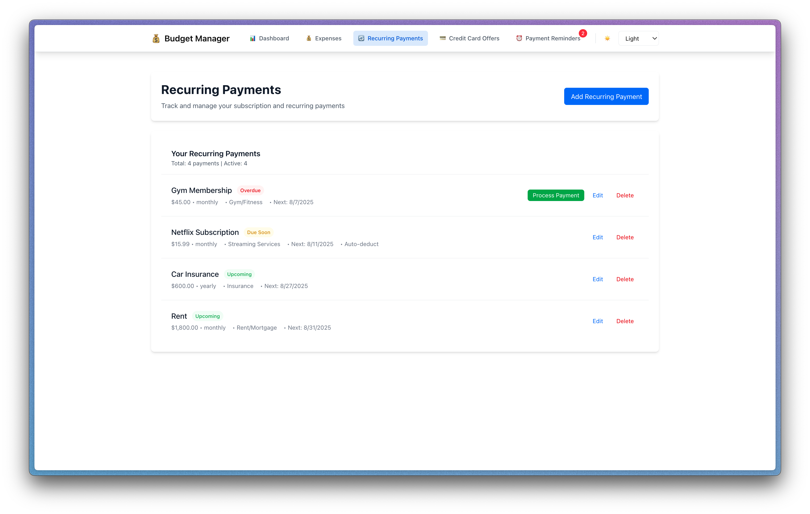
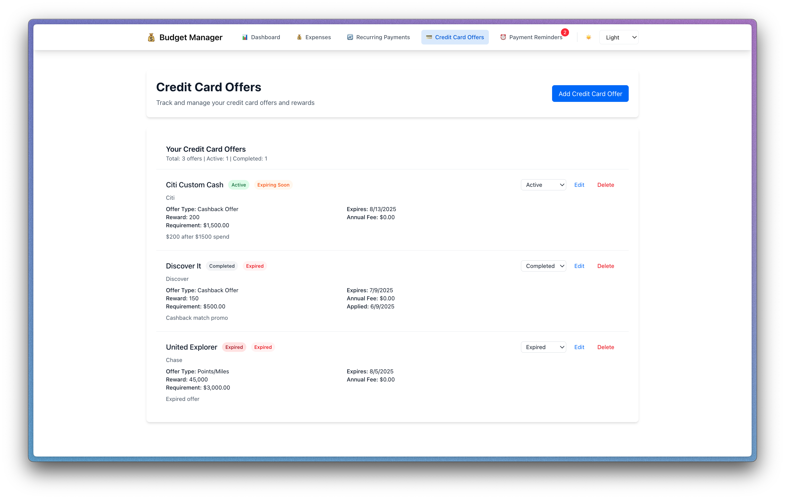
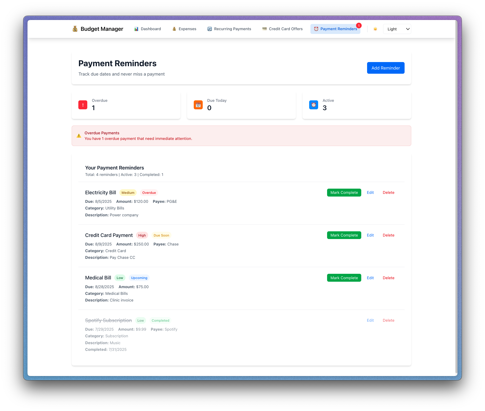
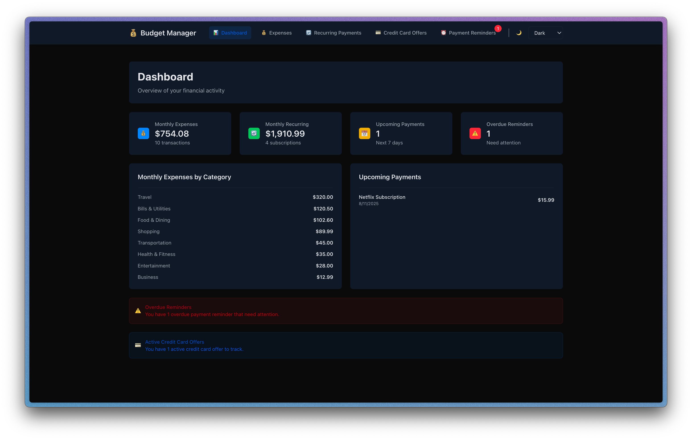

## React Budget Manager

A modern personal finance dashboard built with Next.js and React. Track expenses, manage recurring payments, monitor credit card offers, and stay on top of payment reminders — all in one place. Data is stored locally in your browser via localStorage, so no backend is required.

### Features

- **Dashboard overview**: Monthly totals, category breakdowns, upcoming payments, overdue reminders, and active offers.
- **Expense tracking**: Add, edit, delete expenses with categories, dates, and amounts.
- **Recurring payments**: Track subscriptions/bills with flexible frequencies and status indicators.
- **Payment reminders**: Set due dates, priorities, payees, and mark completed items.
- **Credit card offers**: Track sign‑up bonuses, rewards, status, and expiration dates.
- **Theme switching**: Light, dark, and system themes.
- **Local persistence**: Automatically saved in `localStorage`.
- **Responsive UI**: Tailwind CSS 4 utility-first styling.

### Screenshots

- **Dashboard**

  

- **Expense Tracker**

  

- **Recurring Payments**

  

- **Credit Card Offers**

  

- **Payment Reminders**

  

- **Dark Theme**

  

### Tech Stack

- **Framework**: Next.js 15 (App Router)
- **UI**: React 19, Tailwind CSS 4
- **State**: React Context + Reducer
- **Persistence**: Browser `localStorage`

### Getting Started

- **Requirements**: Node.js 18.18+ (or 20+ recommended) and npm/yarn/pnpm/bun.

1. Install dependencies:

```bash
npm install
```

2. Run the development server:

```bash
npm run dev
```

3. Open `http://localhost:3000` in your browser.

### Available Scripts

- **dev**: Start the Next.js dev server

  ```bash
  npm run dev
  ```

- **build**: Production build

  ```bash
  npm run build
  ```

- **start**: Start the production server

  ```bash
  npm run start
  ```

- **lint**: Run ESLint

  ```bash
  npm run lint
  ```

### Project Structure

- `src/app/page.js`: Entry; routes between pages within the single-page navigation
- `src/app/layout.js`: Global layout; wraps providers
- `src/app/context/BudgetContext.js`: App state (expenses, recurring payments, offers, reminders)
- `src/app/context/ThemeContext.js`: Theme selection and persistence
- `src/app/components/Navigation.js`: Top navigation + theme controls
- `src/app/components/Dashboard.js`: KPIs, breakdowns, upcoming and overdue
- `src/app/components/ExpenseTracker.js`: CRUD for expenses
- `src/app/components/RecurringPayments.js`: CRUD for recurring payments + processing
- `src/app/components/PaymentReminders.js`: CRUD and completion for reminders
- `src/app/components/CreditCardOffers.js`: CRUD and status for card offers

### Data & Persistence

All data is stored locally in your browser’s `localStorage` under the key `budget-app-data`. Clearing site data will reset the app.

### Styling

Tailwind CSS 4 is configured via PostCSS. Global styles live in `src/app/globals.css`. Theme is applied to the `<html>` element via `data-theme` and optional `.dark` class for dark mode.
